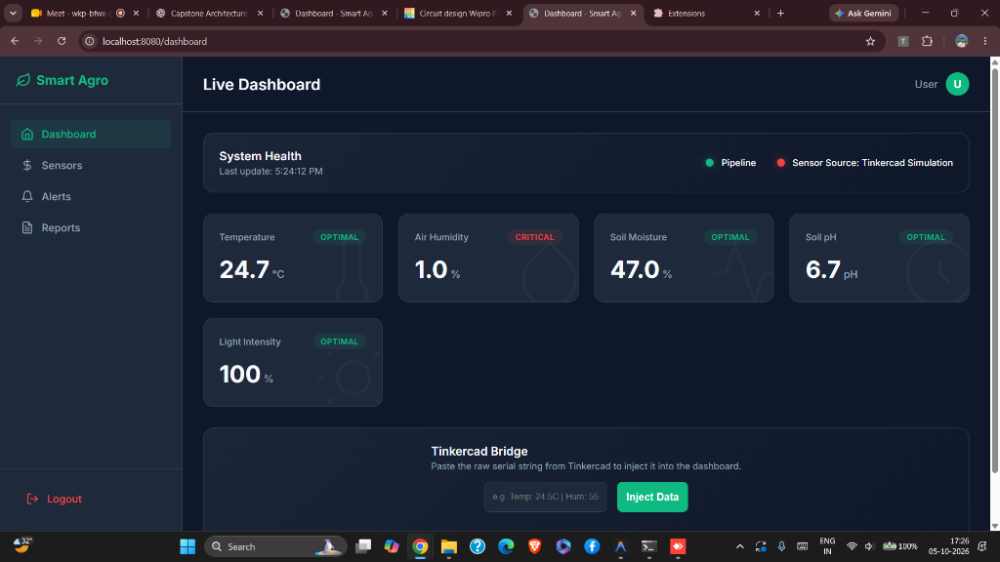

# 🌱 Smart Agriculture Monitoring System



A high-performance, C++-based Smart Agriculture Monitoring System designed for Linux and Windows Subsystem for Linux (WSL). This project features a native POSIX-compliant backend for robust data ingestion, a real-time sequential processing pipeline, Firebase integration, and a modern web dashboard.

## 🚀 Features

- **Real-Time Data Pipeline**: A multi-threaded C++ architecture handling high-speed sensor data ingestion, parsing, validation, and analytics processing.
- **Tinkercad Live Bridge**: Seamlessly bridges your browser-based Arduino simulations (Tinkercad) directly to your local C++ server in real-time using a custom Chrome Extension.
- **Hardware Agnostic**: Includes support for standard Arduino serial communication (`/dev/ttyACM0`), virtual simulation data generation, and external HTTP API ingestion.
- **Modern Web Dashboard**: A sleek, fully responsive dashboard running securely on an embedded HTTP web server framework (Crow) directly from C++.
- **Firebase Persistance**: Automatically caches real-time telemetry over secure HTTPS utilizing `libcurl`.

---

## 🛠️ Tech Stack

- **Backend / Core Pipeline**: Modern C++17, POSIX Threads (<thread>), `<atomic>`
- **Web Server API**: Crow (C++ Microframework)
- **Networking**: `libcurl` for cloud persistence
- **Frontend / Dashboard**: HTML, Vanilla JavaScript, CSS variables (No bloat!)
- **Testing**: GoogleTest (gtest)
- **Build System**: CMake, GNU Make

---

## 💻 Installation & Running locally (Linux / WSL)

Since this project leverages native Unix processes for peak performance, it is intended to be run in a standard Linux environment (Ubuntu, Debian, or **WSL on Windows**).

### 1. Prerequisites
Ensure you have standard C++ build tools installed in your Linux/WSL environment:
```bash
sudo apt update
sudo apt install build-essential cmake libcurl4-openssl-dev
```

### 2. Configure Environment Secrets
Create and fill out your `.env` configuration file in the project's root folder:
```ini
# Database (Optional for purely local testing)
FIREBASE_DB_URL=https://<your-project>.firebaseio.com/
FIREBASE_API_KEY=your_api_key

# Mode Settings (tinkercad | simulation | arduino)
APP_MODE=tinkercad
TINKERCAD_BRIDGE_TOKEN=dev-secret-token-123
```

### 3. Build the Application
```bash
# Navigate to project folder
cd /mnt/d/Wipro\ Project/Smart\ Agriculture\ System

# Create a build directory
mkdir -p build && cd build

# Generate Makefiles and compile cleanly across CPU cores
cmake ..
make -j$(nproc)
```

### 4. Run the Server!
Once compiled, you can launch the server by executing the compiled application wrapper:
```bash
./smart_agriculture
```
*The server will boot up and immediately expose the UI at **http://localhost:8080**.*

---

## 🔌 Using the Tinkercad Live Simulator Bridge

Because Tinkercad is entirely web-based, we use a custom Chrome Extension to automatically catch data emitted by your simulated Arduino Serial Monitor and securely funnel it back to this C++ server.

1. Ensure your `.env` is configured with `APP_MODE=tinkercad`.
2. Start the `smart_agriculture` server in WSL so `localhost:8080` comes online.
3. Open Google Chrome and go to `chrome://extensions/`.
4. Enable **Developer Mode**, click **Load Unpacked**, and select the `/tinkercad_bridge` folder from this project directory.
5. Open your Tinkercad web tab, press **F5 to refresh**, and start your active simulation!
6. Visit `http://localhost:8080` to watch the numbers update cleanly in real-time.

---

## 📁 Project Structure

```text
├── CMakeLists.txt         # Build Configuration
├── .env                   # Mode and API secrets
├── .env.example           # Safely commitable template
├── src/                   # C++ Implementation Files (.cpp)
├── include/               # C++ Header Files (.hpp)
├── tests/                 # GoogleTest Test Suites
├── web/                   # Embedded Dashboard Assets (HTML/JS/CSS)
│   ├── templates/         # Crow Server Views
│   └── static/            # Native Styles and Client-Side Logic
└── tinkercad_bridge/      # Chrome Extension for Simulator Intercept
```
